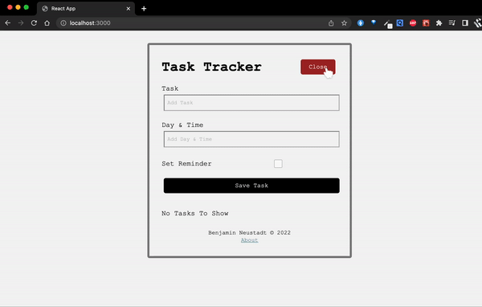

# Getting Started with Create React App

This project was bootstrapped with [Create React App](https://github.com/facebook/create-react-app).

> **_Description:_** 
A task tracker app built using React.
Each component has its peice of state, component level state , not app level state.
This was initimidating at first, but doing things like this in vanilla javasciprt can be more messy, unorganised, and difficult.

---

## Demo:




---
[Mock Backend](#server)
[Available Scripts](#scripts)
[Deployment](#deploy)
[Resource](#learning_resource)

---

<a name="scripts"></a>
## Available Scripts

In the project directory, you can run:

### `npm start`

Runs the app in the development mode.\
Open [http://localhost:3000](http://localhost:3000) to view it in your browser.

The page will reload when you make changes.\
You may also see any lint errors in the console.

### `npm test`

Launches the test runner in the interactive watch mode.\
See the section about [running tests](https://facebook.github.io/create-react-app/docs/running-tests) for more information.

### `npm run build`

Builds the app for production to the `build` folder.\
It correctly bundles React in production mode and optimizes the build for the best performance.

The build is minified and the filenames include the hashes.\
Your app is ready to be deployed!

See the section about [deployment](https://facebook.github.io/create-react-app/docs/deployment) for more information.

### `npm run eject`

**Note: this is a one-way operation. Once you `eject`, you can't go back!**

If you aren't satisfied with the build tool and configuration choices, you can `eject` at any time. This command will remove the single build dependency from your project.

Instead, it will copy all the configuration files and the transitive dependencies (webpack, Babel, ESLint, etc) right into your project so you have full control over them. All of the commands except `eject` will still work, but they will point to the copied scripts so you can tweak them. At this point you're on your own.

You don't have to ever use `eject`. The curated feature set is suitable for small and middle deployments, and you shouldn't feel obligated to use this feature. However we understand that this tool wouldn't be useful if you couldn't customize it when you are ready for it.

## Learn More

You can learn more in the [Create React App documentation](https://facebook.github.io/create-react-app/docs/getting-started).

To learn React, check out the [React documentation](https://reactjs.org/).

### Code Splitting

This section has moved here: [https://facebook.github.io/create-react-app/docs/code-splitting](https://facebook.github.io/create-react-app/docs/code-splitting)

### Analyzing the Bundle Size

This section has moved here: [https://facebook.github.io/create-react-app/docs/analyzing-the-bundle-size](https://facebook.github.io/create-react-app/docs/analyzing-the-bundle-size)

### Making a Progressive Web App

This section has moved here: [https://facebook.github.io/create-react-app/docs/making-a-progressive-web-app](https://facebook.github.io/create-react-app/docs/making-a-progressive-web-app)

### Advanced Configuration

This section has moved here: [https://facebook.github.io/create-react-app/docs/advanced-configuration](https://facebook.github.io/create-react-app/docs/advanced-configuration)

### Deployment

This section has moved here: [https://facebook.github.io/create-react-app/docs/deployment](https://facebook.github.io/create-react-app/docs/deployment)

### `npm run build` fails to minify

This section has moved here: [https://facebook.github.io/create-react-app/docs/troubleshooting#npm-run-build-fails-to-minify](https://facebook.github.io/create-react-app/docs/troubleshooting#npm-run-build-fails-to-minify)


You can turn this into a full stack application by having a backend, some kind of API that you can make requests to, and fetch data from (think about having a local database for this, either MONGODB NOSQL). In this case we have used [Json server](#server).


<a name="server"></a>
## Mock backend:
#### Json server

- We use Json server, to make mock API with our own server: https://www.npmjs.com/package/json-server

- We can make _POST_ resquests, _PUT_ requests, as if it were a real backend.

We can even check for the restful API on the browser by typing in "http://localhost:5000/tasks" and we will see: 
```
[
  {
    "id": 1,
    "text": "Doctors Appointment",
    "day": "Feb 5th at 2:30pm",
    "reminder": true
  },
  {
    "id": 2,
    "text": "Meeting at School",
    "day": "Feb 3th at 09:30am",
    "reminder": true
  },
  {
    "id": 3,
    "text": "Swimming lesson",
    "day": "Feb 7th at 12:30pm",
    "reminder": false
  }
]
```


1. If 'jquery' is installed locally with `npm install jq` we can also check the contents of the db.json file by doing the following inside the correct directory: 

`cat db.json | jq`

2. We get the following output:


| :exclamation:  Important Warning   |
|-----------------------------------------|

>Having such an API tethered to the program is not a replacement for a cloud database, as naturally the contents of the database would be accessible by anyone using the software, unless it is truncated before publishing.

| :exclamation:  Important Warning   |
|-----------------------------------------|

>If there is a bug with the program, all data stored inside the file would also be compromised, so this is not a work around to using a cloud database or local database (with an ORM)

<a name="deploy"></a>
### When ready to deploy: 

- Stop the server
- `npm run build` (creates static assets in build folder)
- Then to try locally, we can install the npm serve package globally.

To install: 

- `sudo npm -i -g serve`

- insert your password

We can now:

`serve -s build -p 8000` the build folder is on port 8000, and local host 3000 no longer works.

We could delete all the rest of the folders and this would still work, because this is our production build.

We have production build, and dev environment now.

<a name="learning_resource"></a>
#### **Resource**: 
https://www.youtube.com/watch?v=w7ejDZ8SWv8


